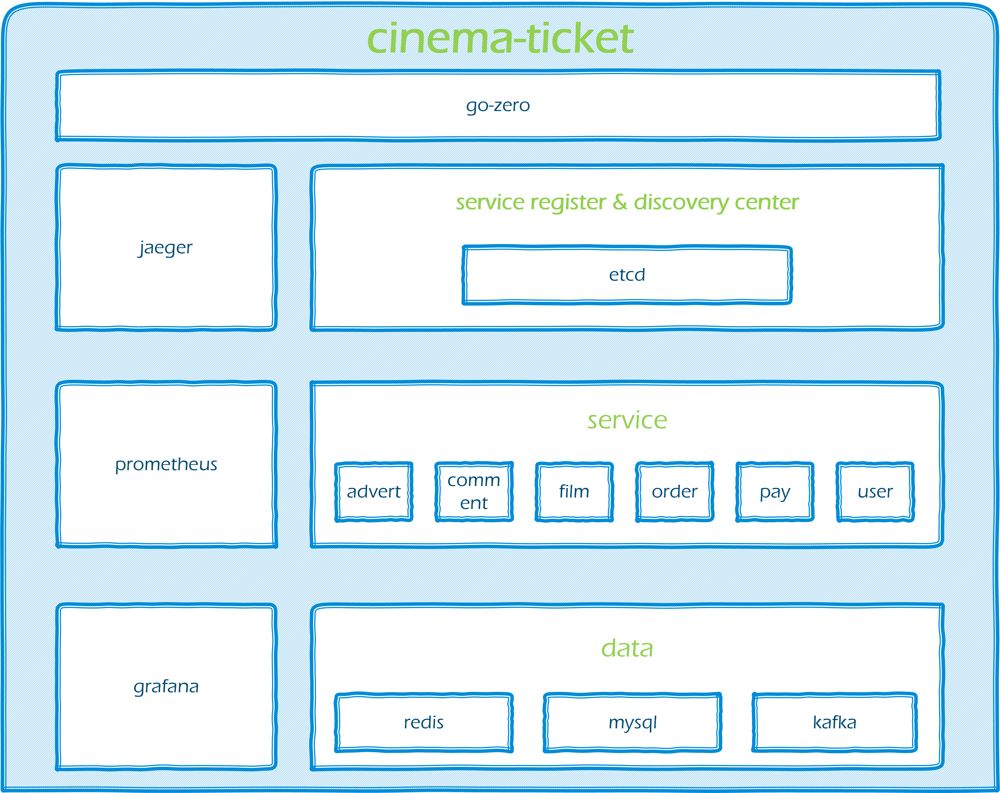
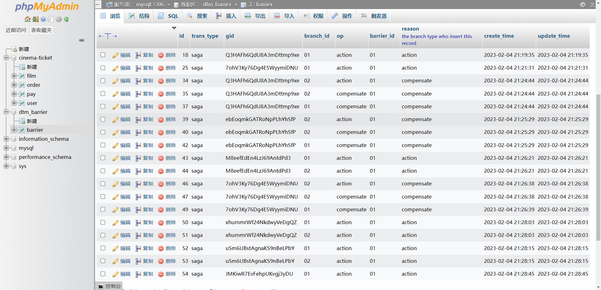
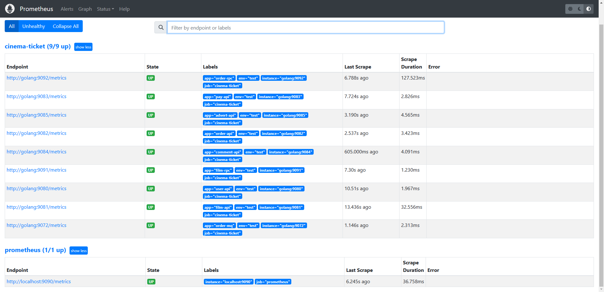
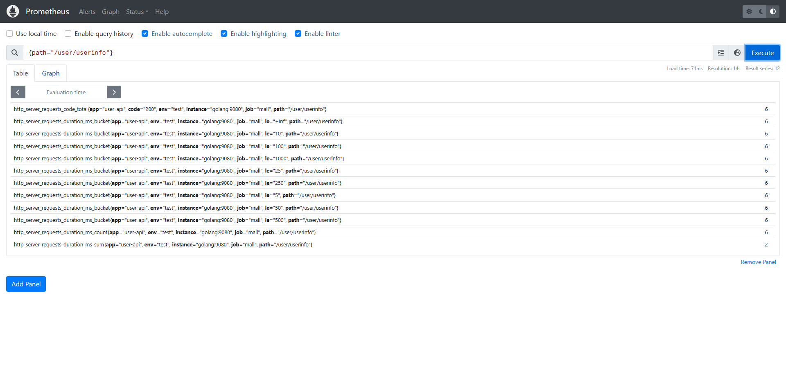
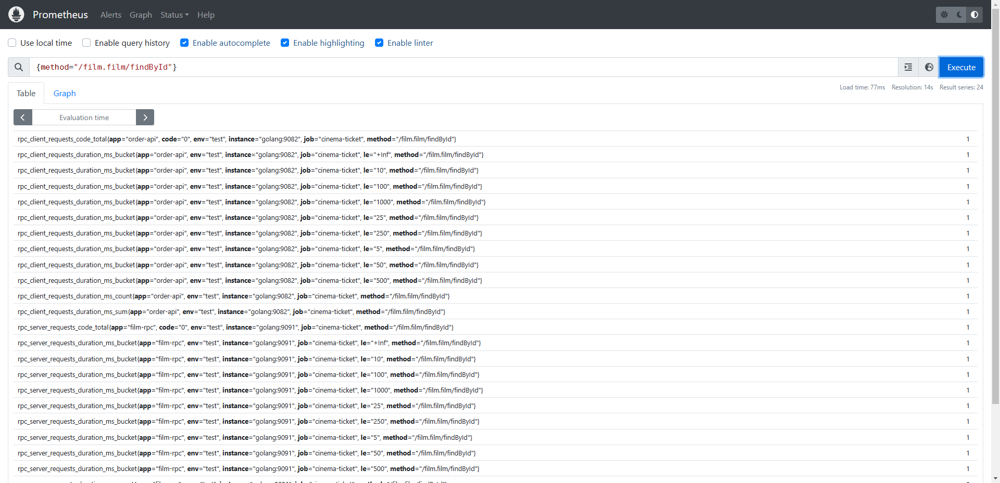
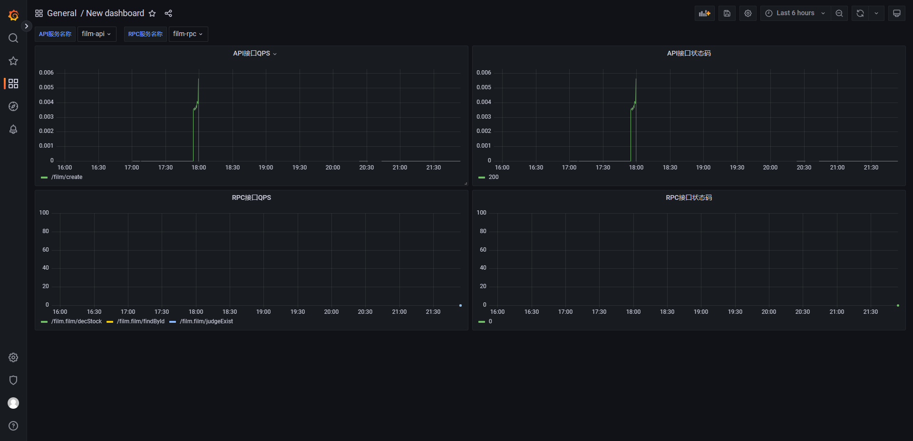
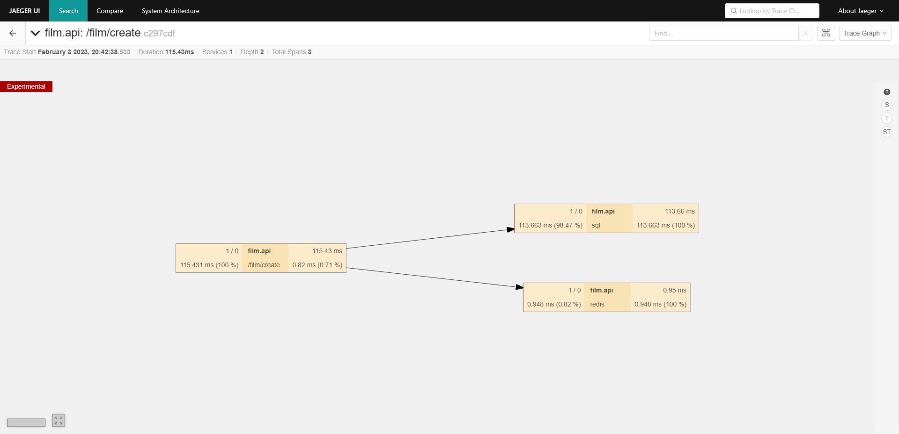
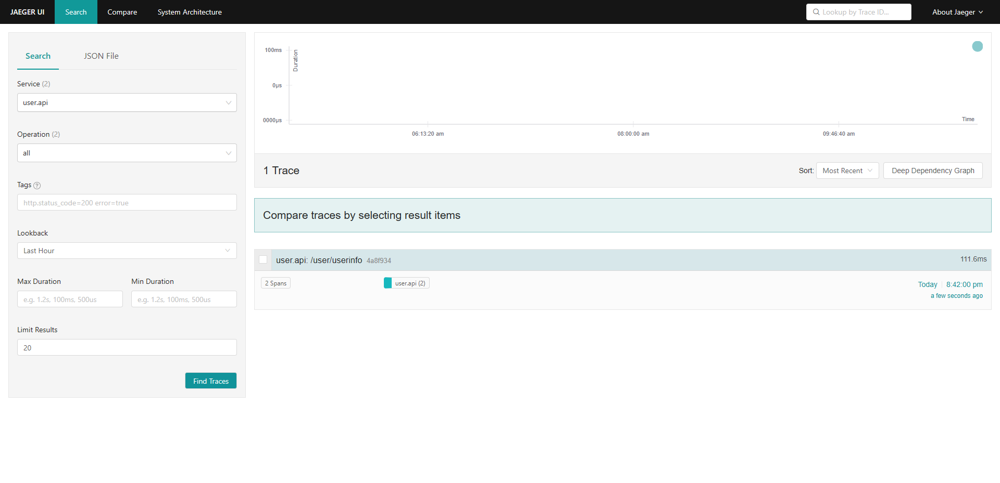

# 一个基于go-zero框架的微服务影院票务系统cinema-ticket

## 前言
### 项目基本介绍
> 项目开源地址：[butane123/cinema-ticket: 一个基于go-zero框架的微服务影院票务系统cinema-ticket (github.com)](https://github.com/butane123/cinema-ticket)
>
> 这是一个微服务影院票务系统，基于go-zero框架实现，官网：[go-zero帮助文档](https://go-zero.dev/cn/docs/introduction)

### 开发背景
cinema-ticket的开发初衷，是通过设计一个自动化销售的影院票务系统，解决票务销售问题，为管理员提供一个井然有序的销售平台，使顾客能够更方便快捷地进行购票。

## 系统设计
### 项目架构图

### 业务架构图


## 项目技术栈&开发环境
* 服务端框架：`go-zero`
* 数据库：`Mysql`
* 缓存：`Redis`
* 本地环境：`Golang 1.18`
* 容器管理：`Docker-Compose`
* 消息队列：`Kafka`
* 服务注册、发现中心：`Etcd`
* 分布式事务：`DTM`
* 服务监控：`Prometheus`、`Grafana`
* 链路追踪：`Jaeger`


使用的技术依赖有点多，强烈建议使用docker配置虚拟环境（不过如果只是想要先跑动项目的话，只要配置redis、mysql、etcd就可以了）

## 项目目录树介绍
```text
cinema-ticket
├─code //代码根目录
│  ├─common //通用工具包
│  │  ├─errorx
│  │  ├─kqueue
│  │  ├─response
│  │  ├─scripts
│  │  └─utils
│  └─service //服务层
│     ├─advert //广告服务
│     │  ├─api
│     │  ├─model
│     │  └─rpc
│     ├─comment //评论服务
│     │  ├─api
│     │  ├─model
│     │  └─rpc
│     ├─film //电影服务
│     │  ├─api
│     │  ├─model
│     │  └─rpc
│     ├─order //订单服务
│     │  ├─api
│     │  ├─model
│     │  ├─mq
│     │  └─rpc
│     ├─pay //支付流水服务
│     │  ├─api
│     │  ├─model
│     │  └─rpc
│     └─user //用户服务
│         ├─api
│         ├─model
│         └─rpc
└─images //ReadMe介绍图片
```

## 微服务内容拆分
该项目的业务逻辑思想来源于当前市场上的其他主流票务系统。
### advert 广告服务
商业广告和普通公告相关信息和操作等服务。

### comment 评论服务
用户评论相关信息和操作等服务。

根据用户的购买记录，推送广告/消息；推送系统公告。
### film 电影服务
电影相关信息和操作等服务。

### order 订单服务
用户订单相关信息和操作等服务。

### pay 支付流水服务
支付流水：用户创建订单后，会生成一份支付流水保存在库中，然后当用户支付后，会进行支付回调，用实际支付的价格判断是否与库中的支付流水价格等信息相同，我们就可以以此来判断支付是否成功。

### user 用户服务
普通用户、管理员相关信息和操作等服务。


## 部分接口特别说明
* `/pay/callback` 支付回调接口：

支付回调是连接订单和支付两个模块的桥梁，先根据订单创建一份支付流水存入数据库，然后回调函数执行时，会把支付的金额与支付流水中的金额进行比较判断，若符合则判断订单生效、流水完成，否则不生效。

支付回调应用场景：

例 ：用户支付成功->通过回调判断->数据库操作（设置订单已支付，流水完成）； 用户支付失败（或取消支付）->通过回调判断->跳转到支付失败页


## 部分项目技术说明
### 消息队列
本项目使用吞吐量大、可用性高的Kafka作为消息队列。go-zero框架原生支持Kafka，可以简化许多配置。

### 分布式事务
本项目在进行不同服务的DML操作，使用分布式事务保证数据一致性。DTM是一个开源的实现分布式事务的工具，基于SAGA 协议。

官网：[DTM架构 | DTM开源项目文档](https://dtm.pub/practice/arch.html#%E5%88%86%E5%B8%83%E5%BC%8F%E4%BA%8B%E5%8A%A1%E8%BF%87%E7%A8%8B)

本项目中的DTM部分子事务屏障日志效果如下：


### 服务监控
本项目使用Prometheus工具统计各个APi服务、RPC各自的监控数据，并用Grafana对数据指标进行表格化展示。

部分效果图如下：
（总览）
（api监控效果）
（rpc监控效果）
（Grafana的折线图效果）

### 链路追踪
本项目使用Jaeger工具实现链路追踪。Jaeger是一个开源的分布式追踪系统，使用这个工具可以轻松地对api、rpc进行链路追踪。

部分效果图如下：

（链路追踪效果）

## 如何运行该系统
### 先做好准备工作
* 填写工具类中的设置常量
    * 为系统的验证码发送邮箱申请授权码，并填写EmailAuthCode等值。注意邮箱要开启SMTP功能服务。
### 再运行基础服务：
* 运行etcd，并配置相应的地址和端口号
* 运行redis，并配置相应的地址和端口号
* ...同上，不再赘述，配置Mysql等在上面技术栈提及的相应技术
### 最后运行项目：
* Linux环境直接按顺序运行脚本startRpc.sh、startMQ.sh、start.sh文件即可。
* Windows环境，可以选择运行六个服务中的共9个yaml文件即可。（Linux环境也可以通过该方式运行项目）

## 尚未完成的：
* [x] ~~修改id为分布式全局统一id~~
* [x] ~~实现查询时的缓存优化，并解决带来的缓存击穿、缓存穿透等问题~~
  * ~~主要针对于对普通用户可能查询量大的电影服务和订单服务~~
* [x] ~~基于分布式锁和消息队列优化用户下单业务~~
* [ ] 完善手机验证码功能


## 最后
本项目是作者在学习golang框架，自建并学习的项目。在构造并完善该项目的过程中，还是学习到了很多内容的。

若有其他问题的欢迎指出。


